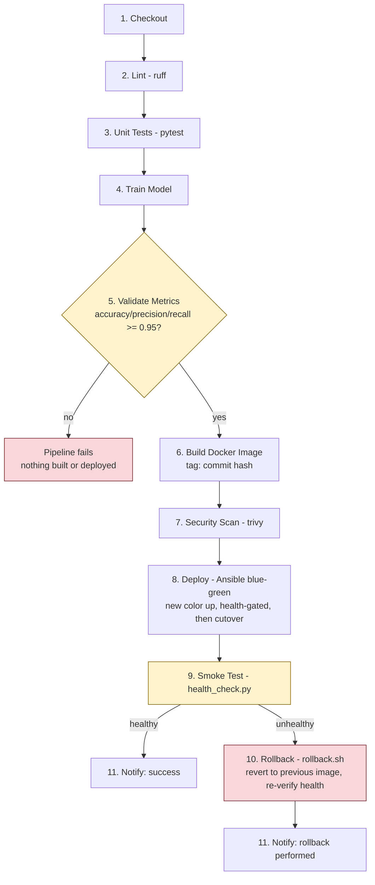

# ml-model-cicd-gate

**A CI/CD pipeline that safely deploys ML models the way automotive software demands: gated, tested, monitored, and reversible.**

This repo trains a small image classifier and ships it through a pipeline that treats the model like any other production artifact: it doesn't get deployed unless it clears a quality gate, it doesn't take traffic unless it passes a health check, and if it fails after deploy, it rolls itself back automatically. The model (a digit classifier on MNIST) is deliberately simple — it's the payload moving through the pipeline, not the point of the project.

## Why this project exists

Built as a portfolio piece for a **CI/CD Integration Engineer** role (Critical TechWorks / BMW). The job calls for Linux, Bash, Python, Git, custom automation tooling, Jenkins, Ansible, Zuul, Docker, GitHub, Prometheus, Grafana, and advanced deployment strategies (blue-green, canary, rolling). This project is a working demonstration of each of those, end to end, with a short honest note on the one item — Zuul — that doesn't fit a single-repo portfolio (see [below](#about-zuul)).

| Requirement | Where it lives |
|---|---|
| CI/CD pipeline design | [`Jenkinsfile`](Jenkinsfile) — 11-stage declarative pipeline |
| Bash | [`scripts/rollback.sh`](scripts/rollback.sh) |
| Python | [`model/`](model/), [`api/`](api/), [`scripts/`](scripts/), [`tests/`](tests/) — typed, PEP8 |
| Git / GitHub | conventional-commit history on this repo; see also [`.github/workflows/mirror-ci.yml`](.github/workflows/mirror-ci.yml) |
| Custom automation tooling | [`scripts/model_gate.py`](scripts/model_gate.py), [`scripts/health_check.py`](scripts/health_check.py), [`scripts/rollback.sh`](scripts/rollback.sh), [`scripts/notify.py`](scripts/notify.py) |
| Jenkins | [`Jenkinsfile`](Jenkinsfile) |
| Ansible | [`ansible/deploy.yml`](ansible/deploy.yml) — blue-green rollout playbook |
| Zuul | not implemented — [scoped and explained below](#about-zuul) |
| Docker | [`Dockerfile`](Dockerfile) (multi-stage: train, then runtime), [`docker-compose.yml`](docker-compose.yml) |
| Prometheus | [`monitoring/prometheus.yml`](monitoring/prometheus.yml), scraping `/metrics` on the API |
| Grafana | [`monitoring/grafana-dashboard.json`](monitoring/grafana-dashboard.json), auto-provisioned |
| Deployment strategies | blue-green implemented in [`ansible/deploy.yml`](ansible/deploy.yml) — [why blue-green here](#why-blue-green-deploy-here) |

## Pipeline



Two gates decide the outcome of every run — full write-up in [`docs/pipeline-diagram.md`](docs/pipeline-diagram.md):

- **Stage 5 (hard gate):** below the accuracy/precision/recall threshold, the pipeline stops before an image is even built. Verified in [`tests/test_model.py`](tests/test_model.py) and by running `scripts/model_gate.py` against artificially degraded metrics.
- **Stage 9 (soft gate):** a failed smoke test doesn't abort the pipeline — it routes into rollback, so the pipeline always ends with a known-good version live and a notification sent either way.

## Why blue-green deploy here

`ansible/deploy.yml` starts the new version (`blue` or `green`) alongside whatever is currently live, on a shared Docker network, and only touches production traffic after the new container passes a real `/health` check. An `nginx` reverse proxy holds the single public port; the playbook rewrites its upstream and reloads it to cut traffic over, then tears down the old color. If the new version never becomes healthy, the playbook removes it and fails the build — the old color is never stopped, so a bad deploy never causes an outage.

This was chosen over canary or rolling for a single-instance API: canary needs traffic splitting infrastructure (weighted routing, a service mesh, or a load balancer with percentage-based rules) that doesn't exist here without external infra, and rolling only makes sense with multiple replicas of the same version being cycled — with one logical instance there's nothing to "roll" incrementally. Blue-green gives the same core guarantee (zero-downtime, instantly reversible cutover, old version stays warm as a fallback) with a single extra container and no orchestrator. `scripts/rollback.sh` handles the same "keep the last N images, jump back to the previous one" idea for the simpler, non-Ansible case (e.g. deploying by hand, or when the platform manages containers directly rather than through the playbook).

All three paths were verified locally against real Docker containers, not just read through: a bootstrap deploy (no prior color), a blue→green cutover with old-container teardown, and an aborted deploy (deliberately broken image) that leaves the previous color fully live and serving traffic.

## About Zuul

Zuul is a gate-oriented CI system built for ecosystems with **many interdependent repositories** (its origin story is OpenStack). Its defining feature is *speculative* testing: it simulates what the merged result of several in-flight changes — across several repositories — would look like, and only lets them merge if that speculative combination passes. That's exactly the shape of a large automotive codebase: firmware, middleware, and app repos that all need to be validated together before any one of them lands.

It's not implemented in this project, on purpose:

1. **The concept needs multiple repositories to mean anything.** A single-repo project can't demonstrate cross-repo speculative gating — there's nothing to speculate about.
2. **The infrastructure is heavy by design.** A real Zuul deployment needs Nodepool for test-node provisioning, Gerrit or GitHub webhooks for event triggering, and Ansible-based executors underneath — it's not a `docker-compose up` away.
3. **A shallow stand-in would be worse than nothing.** A single Zuul job running alone, with no gate pipeline and no second repo to test against, would just be decoration. Anyone who's used Zuul would spot it immediately, and it would raise more doubt than it resolves.

What this project uses instead: **Jenkins with a single quality gate** (`scripts/model_gate.py`, stage 5 above) — the right-sized tool for a mono-repo pipeline where "should this build proceed" has one clear, local answer. If this project grew into multiple interdependent repos (say, the model training repo, the serving API repo, and an edge-deployment repo, each needing to be validated together), Zuul's speculative multi-repo gating would become the right tool, and Jenkins would start showing its limits. Knowing that boundary — not just knowing the tool — is the point of this section.

## Running locally

Requires Docker and Docker Compose.

```bash
docker compose up --build
```

This builds the API image (training the model in the first Docker stage, ~10-20s on a laptop), then starts:

- **API** — http://localhost:8000 (`/predict`, `/health`, `/metrics`)
- **Prometheus** — http://localhost:9090 (scraping the API every 5s)
- **Grafana** — http://localhost:3000 (`admin` / `admin`, or open anonymously — dashboard is auto-provisioned)

Try it:

```bash
curl localhost:8000/health
curl -X POST -F "file=@some_digit.png" localhost:8000/predict
```

Full request/response schemas, error codes, and environment variables: [`docs/api.md`](docs/api.md).

### Training reproducibility

`model/train.py` pins every RNG it touches (`random`, `numpy`, `torch`) via `set_seed()`, defaulting to seed `42` and overridable with `TRAIN_SEED` (or `--seed`). It also calls `torch.use_deterministic_algorithms(True)` and sets `CUBLAS_WORKSPACE_CONFIG` for deterministic cuBLAS kernels on GPU. On the CPU-only path this project and CI actually run on, that determinism call has no measurable performance cost — verified by running training twice and diffing `metrics.json` byte-for-byte. Default epochs were raised from 5 to 10 (accuracy 0.9525 -> 0.975) so the gate has real margin instead of sitting a quarter-point above its 0.95 threshold.

### Running the pipeline stages by hand

```bash
python3.12 -m venv .venv && source .venv/bin/activate
pip install -r requirements-dev.txt

ruff check .                          # 2. Lint
pytest tests/ -q                      # 3. Unit Tests
python model/train.py                 # 4. Train Model
python scripts/model_gate.py          # 5. Validate Metrics (the gate)
docker build -t ml-model-cicd-gate-api:local .   # 6. Build Docker Image

# 8. Deploy (blue-green, needs the image above and the community.docker
#    Ansible collection: ansible-galaxy collection install -r ansible/requirements.yml)
ansible-playbook -i ansible/inventory.ini ansible/deploy.yml -e app_tag=local

python scripts/health_check.py        # 9. Smoke Test
./scripts/rollback.sh                 # 10. Rollback (only if 9 fails)
```

To see the gate actually block a bad model, drop the accuracy in `model/artifacts/metrics.json` below 0.95 and re-run `scripts/model_gate.py` — it exits non-zero and prints exactly which metric failed.

## Grafana dashboard

Auto-provisioned from [`monitoring/grafana-dashboard.json`](monitoring/grafana-dashboard.json) on first boot — no manual import needed. Six panels, all backed by the API's own `/metrics` endpoint:

- **API latency (p95)** — `histogram_quantile` over `http_request_duration_seconds` (RED metric, via `prometheus-fastapi-instrumentator`)
- **Error rate** — 5xx responses as a fraction of total requests (RED metric)
- **Requests per second**, broken down by handler (RED metric)
- **Shipped model accuracy** — a gauge (`ml_model_training_accuracy`) the API sets once at startup from `metrics.json`. This is a *training-time* number from the held-out test set, not a live production measurement — there's no ground truth to score live predictions against without a labeling pipeline, so don't read it as "how the model is doing right now."
- **Predictions by class** — `ml_predictions_total`, a counter labeled by predicted digit, incremented on every `/predict` call. This and the panel below are the actual live ML-observability signals: what's being asked of the model and how it's answering, in production.
- **Prediction confidence (p50/p95)** — `ml_prediction_confidence`, a histogram of the top-1 softmax probability per prediction. A sustained drop here (without a matching change in traffic pattern) is the practical early-warning signal for drift, since there's no live accuracy metric to watch directly.

## Connection to the AI postgraduate work

This project pairs with coursework from the *Pós-graduação em Inteligência Artificial* at PUC Minas (Python for Data Science, MLOps/DataOps). The training code (`model/train.py`, `model/evaluate.py`) and the metrics format they produce come straight out of that coursework; what this repo adds is the operational half most ML courses skip — the model isn't "done" when it trains well, it's done when it's gated, deployed safely, observable in production, and reversible on failure. That operational discipline is the actual subject of this project.
