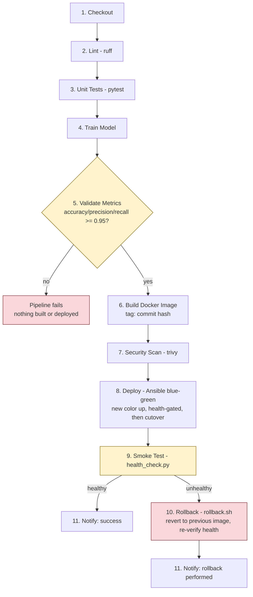

# Pipeline flow

The 11 Jenkins stages, and where the rollback branch diverges from the happy path.

Two gates decide the outcome of every run:

- **Stage 5** is a hard gate: below threshold, the pipeline stops before an image is even built.
- **Stage 9** is a soft gate: a failed smoke test doesn't abort the pipeline, it routes into rollback so the pipeline always ends with a known-good version live and a notification sent either way.
